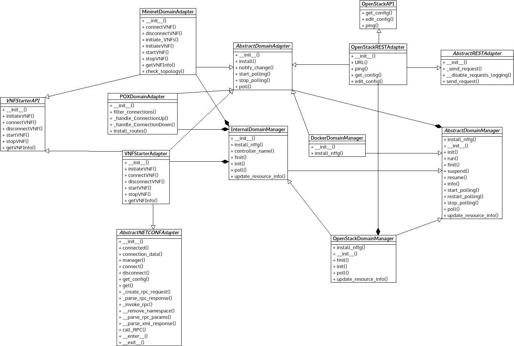

*adapters.py* module
====================

Contains Adapter classes which contains protocol and technology specific
details for the connections between ESCAPEv2 and other different domains.

:any:`InternalPOXAdapter` implements the OF controller functionality for the
Mininet-based emulated topology.

:any:`SDNDomainPOXAdapter` implements the OF controller functionality for the
external SDN/OpenFlow switches.

:any:`InternalMininetAdapter` implements Mininet related functionality
transparently e.g. start/stop/clean topology built from an :any:'NFFG'.

:any:`VNFStarterAdapter` is a helper/wrapper class for vnf_starter NETCONF
module.

:any:`RemoteESCAPEv2RESTAdapter` is a wrapper class for REST-based communication
with an another ESCAPE instance started in agent mode.

:any:`OpenStackRESTAdapter` is a wrapper class for OpenStack-REST-like API
functions.

:any:`UniversalNodeRESTAdapter` is a wrapper class for REST-like communication
with the Universal Node domain.

Module contents
---------------

.. automodule:: escape.adapt.adapters
   :members:
   :private-members:
   :special-members:
   :exclude-members: __dict__,__weakref__,__module__
   :undoc-members:
   :show-inheritance:

