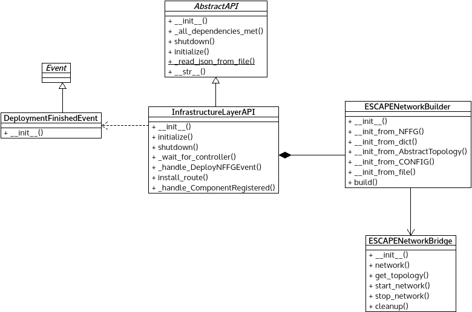

*il_API.py* module
==================

Emulate UNIFY's Infrastructure Layer for testing purposes based on Mininet.

:any:`DeploymentFinishedEvent` can send status info about NFFG deployment.

:any:`InfrastructureLayerAPI` represents the IL layer and implement all
related functionality.

Module contents
---------------

.. automodule:: escape.infr.il_API
   :members:
   :private-members:
   :special-members:
   :exclude-members: __dict__,__weakref__,__module__
   :undoc-members:
   :show-inheritance:
