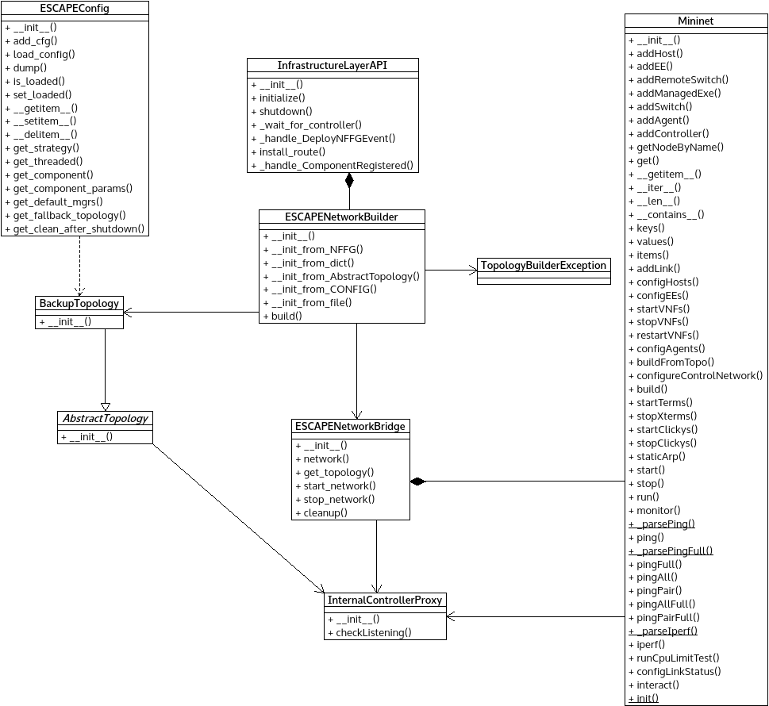

*topology.py* module
====================

Wrapper module for handling emulated test topology based on Mininet.

:any:`AbstractTopology` can represent an emulated topology for the high-level
API.

:any:`FallbackStaticTopology` represents the static fallback topology.

:any:`InternalControllerProxy` represents the connection between the internal
controller and the emulated network.

:any:`ESCAPENetworkBridge` represents the emulated topology in high level.

:any:`TopologyBuilderException` can signal various error related to the topology
emulation.

:any:`ESCAPENetworkBuilder` can construct a:any:`ESCAPENetworkBridge` object.

Module contents
---------------

.. automodule:: escape.infr.topology
   :members:
   :private-members:
   :special-members:
   :exclude-members: __dict__,__weakref__,__module__
   :undoc-members:
   :show-inheritance:
