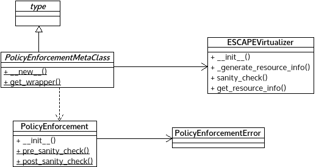

*policy_enforcement.py* module
==============================

Contains functionality related to policy enforcement.

:any:`PolicyEnforcementError` represents a violation during the policy
checking process.

:any:`PolicyEnforcementMetaClass` contains the main general logic which
handles the Virtualizers and enforce policies.

:any:`PolicyEnforcement` implements the actual enforcement logic.

Module contents
---------------

.. automodule:: escape.orchest.policy_enforcement
   :members:
   :private-members:
   :special-members:
   :exclude-members: __dict__,__weakref__,__module__
   :undoc-members:
   :show-inheritance:
