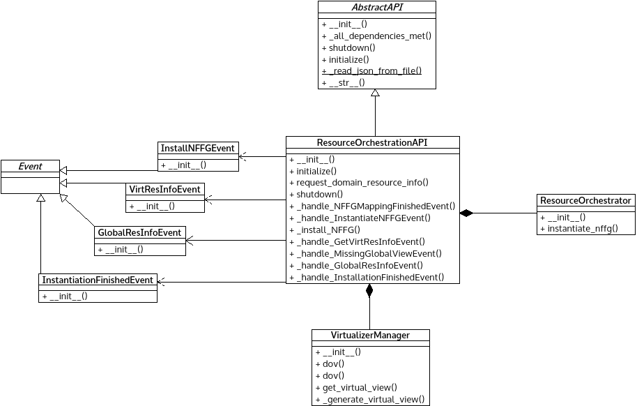

*ros_API.py* module
===================

Implements the platform and POX dependent logic for the Resource Orchestration
Sublayer.

:any:`InstallNFFGEvent` can send mapped NF-FG to the lower layer.

:any:`VirtResInfoEvent` can send back virtual resource info requested from
upper layer.

:any:`GetGlobalResInfoEvent` can request global resource info from lower layer.

:any:`InstantiationFinishedEvent` can signal info about NFFG instantiation.

:any:`ResourceOrchestrationAPI` represents the ROS layer and implement all
related functionality.

Module contents
---------------

.. automodule:: escape.orchest.ros_API
   :members:
   :private-members:
   :special-members:
   :exclude-members: __dict__,__weakref__,__module__,_eventMixin_events
   :undoc-members:
   :show-inheritance:

