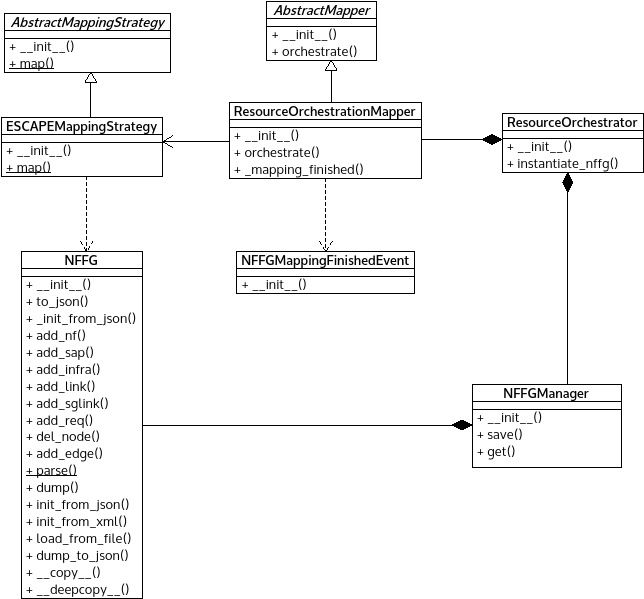

*ros_mapping.py* module
=======================

Contains classes which implement :any:`NFFG` mapping functionality.

:any:`ESCAPEMappingStrategy` implements a default :any:`NFFG` mapping algorithm
of ESCAPEv2.

:any:`NFFGMappingFinishedEvent` can signal the state of NFFG mapping.

:any:`ResourceOrchestrationMapper` perform the supplementary tasks for
:any:`NFFG` mapping.

Module contents
---------------

.. automodule:: escape.orchest.ros_mapping
   :members:
   :private-members:
   :special-members:
   :exclude-members: __dict__,__weakref__,__module__
   :undoc-members:
   :show-inheritance:
