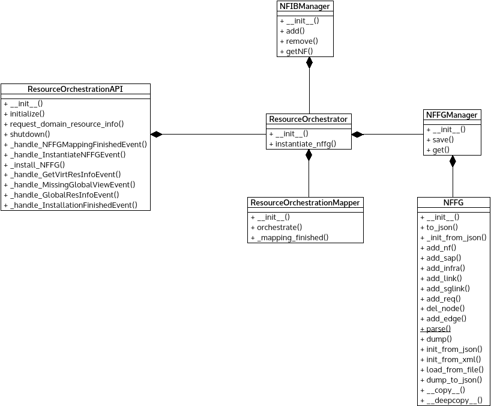

*ros_orchestration.py* module
=============================

Contains classes relevant to Resource Orchestration Sublayer functionality.

:any:`ResourceOrchestrator` orchestrates :any:`NFFG` mapping and centralize
layer logic.

:any:`NFFGManager` stores and handles Network Function Forwarding Graphs.

:any:`NFIBManager` handles the Network Function Information Base and hides
implementation dependent logic.

Module contents
---------------

.. automodule:: escape.orchest.ros_orchestration
   :members:
   :private-members:
   :special-members:
   :exclude-members: __dict__,__weakref__,__module__
   :undoc-members:
   :show-inheritance:
