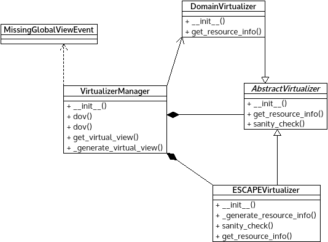

*virtualization_mgmt.py* module
===============================

Contains components relevant to virtualization of resources and views.

:any:`AbstractVirtualizer` contains the  central logic of Virtualizers.

:any:`OneBisBisVirtualizer` implement the default, 1BisBis virtualization
logic of the Resource Orchestration Sublayer.

:any:`MissingGlobalViewEvent` can signal missing global view.

:any:`VirtualizerManager` stores and handles the virtualizers.

Module contents
---------------

.. automodule:: escape.orchest.virtualization_mgmt
   :members:
   :private-members:
   :special-members:
   :exclude-members: __dict__,__weakref__,__module__
   :undoc-members:
   :show-inheritance:
