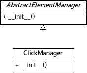

*element_mgmt.py* module
========================

Contains classes relevant to element management.

:any:`AbstractElementManager` is an abstract class for element managers.

:any:`ClickManager` represent the interface to Click elements.

Module contents
---------------

.. automodule:: escape.service.element_mgmt
   :members:
   :private-members:
   :special-members:
   :exclude-members: __dict__,__weakref__,__module__
   :undoc-members:
   :show-inheritance:

