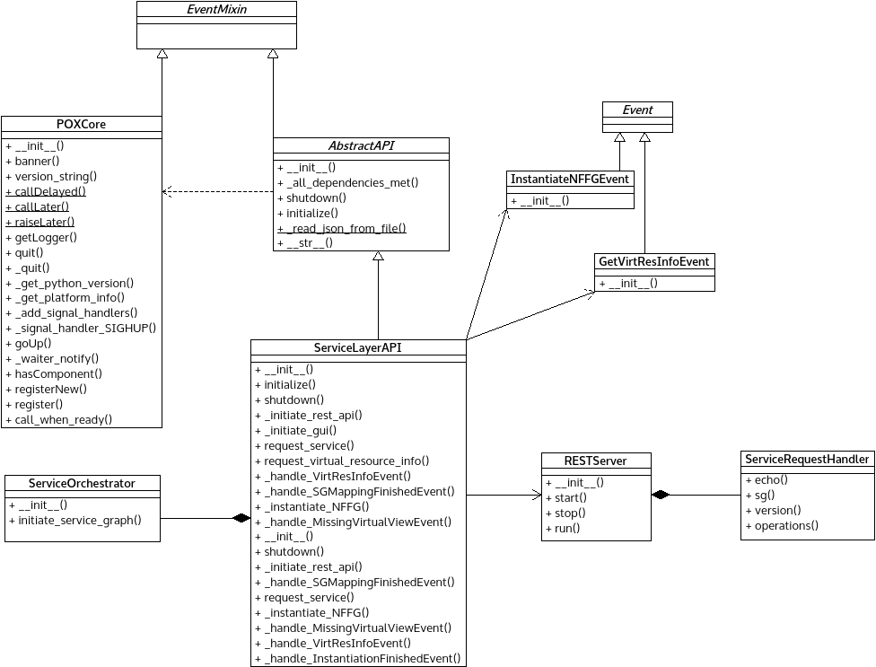

*sas_API.py* module
===================

Implements the platform and POX dependent logic for the Service Adaptation
Sublayer.

:any:`InstantiateNFFGEvent` can send NF-FG to the lower layer.

:any:`GetVirtResInfoEvent` can request virtual resource info from lower layer.

:any:`ServiceRequestHandler` implement the specific RESTful API functionality
thereby realizes the UNIFY's U - Sl API.

:any:`ServiceLayerAPI` represents the SAS layer and implement all related
functionality.

Module contents
---------------

.. automodule:: escape.service.sas_API
   :members:
   :private-members:
   :special-members:
   :exclude-members: __dict__,__weakref__,__module__,_eventMixin_events
   :undoc-members:
   :show-inheritance:

