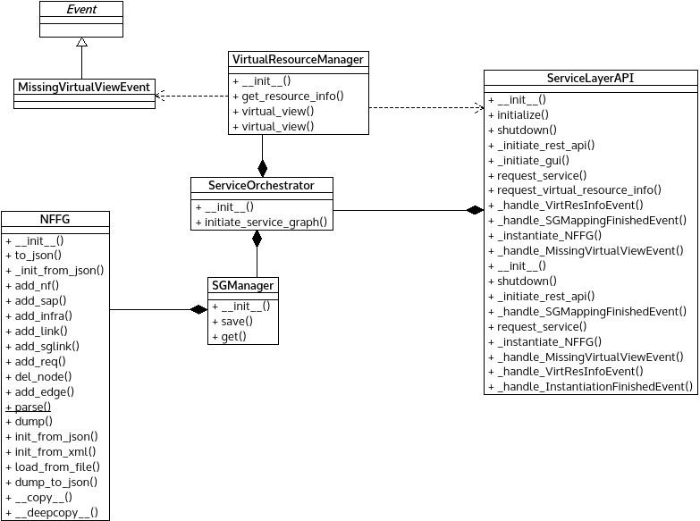

*sas_orchestration.py* module
=============================

Contains classes relevant to Service Adaptation Sublayer functionality.

:any:`ServiceOrchestrator` orchestrates SG mapping and centralize layer logic.

:any:`SGManager` stores and handles Service Graphs.

:any:`MissingVirtualViewEvent` can signal missing virtual info.

:any:`VirtualResourceManager` contains the functionality tided to the
layer's virtual view and virtual resources.

Module contents
---------------

.. automodule:: escape.service.sas_orchestration
   :members:
   :private-members:
   :special-members:
   :exclude-members: __dict__,__weakref__,__module__
   :undoc-members:
   :show-inheritance:
