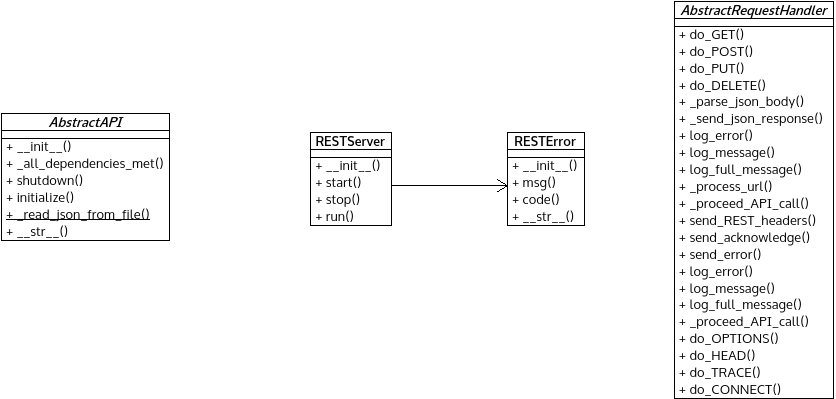

*api.py* module
===============

Contains abstract classes for concrete layer API modules.

:any:`AbstractAPI` contains the register mechanism into the POX core for
layer APIs, the event handling/registering logic and defines the general
functions for initialization and finalization steps.

:any:`RESTServer` is a general HTTP server which parse HTTP request and
forward to explicitly given request handler.

:any:`RESTError` can signal various error related to RESTful communication.

:any:`AbstractRequestHandler` is a base class for concrete request handling.
It implements the general URL and request body parsing functions.

Module contents
---------------

.. automodule:: escape.util.api
   :members:
   :private-members:
   :special-members:
   :exclude-members: __dict__,__weakref__,__module__
   :undoc-members:
   :show-inheritance:
