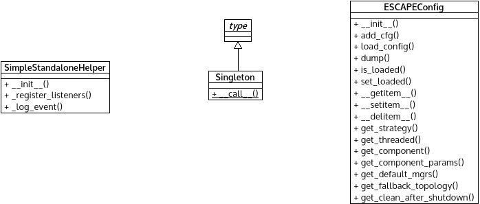

*misc.py* module
================

Contains miscellaneous helper functions.

:any:`schedule_as_coop_task()` helps invoking a function in POX's cooperative
microtask environment.

:any:`call_as_coop_task()` hides POC core functionality and schedule a
function in the coop microtask environment directly.

:any:`enum()` is a helper function to generate Pythonic enumeration.

:any:`quit_with_error()`  is a helper function to terminate POX.

:any:`SimpleStandaloneHelper` is a helper class for mimic a minimal layer
API as a dependency for other layer APIs to handles events.

:any:`Singleton` is a metaclass to implements singleton object.

Module contents
---------------

.. automodule:: escape.util.misc
   :members:
   :private-members:
   :special-members:
   :exclude-members: __dict__,__weakref__,__module__
   :undoc-members:
   :show-inheritance:

