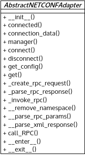

*netconf.py* module
===================

Implement the supporting classes for communication over NETCONF.

Requirements::

  sudo apt-get install python-setuptools python-paramiko python-lxml \
  python-libxml2 python-libxslt1 libxml2 libxslt1-dev

  sudo pip install ncclient

:any:`AbstractNETCONFAdapter` contains the main function for communication
over NETCONF such as managing SSH channel, handling configuration, assemble
RPC request and parse RPC reply.

Module contents
---------------

.. automodule:: escape.util.netconf
   :members:
   :private-members:
   :special-members:
   :exclude-members: __dict__,__weakref__,__module__
   :undoc-members:
   :show-inheritance:

