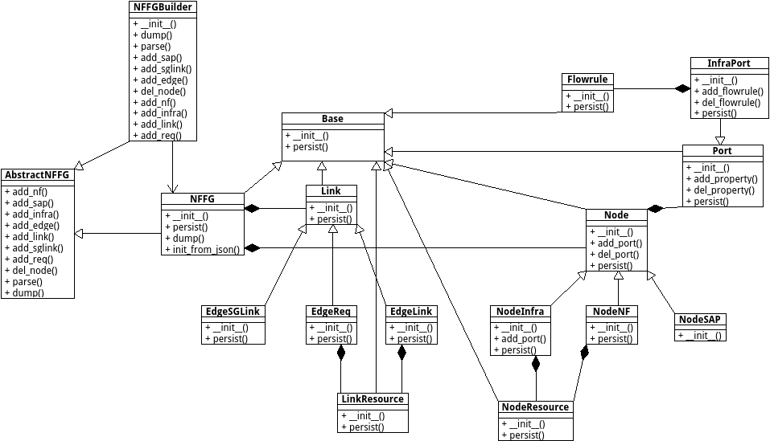

*nffg_elements.py* module
=========================

Element classes for NFFG.

:any:`NFFGContainer` represents the main container class.

:any:`Base` represents the common functions for elements.

:any:`Node` represents the common functions for Node elements.

:any:`Link` represents the common functions for Edge elements.

:any:`NodeResource` represents the resource attributes of a Node.

:any:`LinkResource` represents the resource attributes of an Edge.

:any:`Flowrule` represents the attributes of a flowrule.

:any:`Port` represents a port of a Node.

:any:`InfraPort` extends the port capabilities for the Infrastructure Node.

:any:`NodeNF` defines the NF type of Node.

:any:`NodeSAP` defines the SAP type of Node.

:any:`NodeInfra` defines the Infrastructure type of Node.

:any:`EdgeLink` defines the dynamic and static connections between Nodes.

:any:`EdgeSGLink` defines the connection between SG elements.

:any:`EdgeReq` defines the requirements between SG elements.

Module contents
---------------

.. automodule:: escape.util.nffg_elements
   :members:
   :private-members:
   :special-members:
   :exclude-members: __dict__,__weakref__,__module__
   :undoc-members:
   :show-inheritance:
